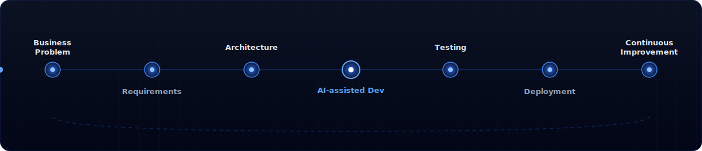
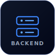
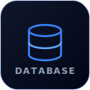
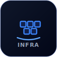
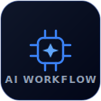

<!-- ╔══════════════════════════════════════════════════════════════╗ -->
<!-- ║  Daniel Teodoro · Profile README · dark / blue design system   ║ -->
<!-- ╚══════════════════════════════════════════════════════════════╝ -->

  

  <a href="./README.md"><b>English</b></a>
  &nbsp;·&nbsp;
  <a href="./README_pt.md">Português</a>

  <code>Software Engineer</code> &nbsp;•&nbsp;
  <code>Business Systems</code> &nbsp;•&nbsp;
  <code>Financial Technology</code> &nbsp;•&nbsp;
  <code>Automation</code>

## &nbsp; The short version

I build the internal software a retail company actually runs on — financial platforms, business dashboards, warehouse and automation tools that people open every morning to make decisions and move money.

I'm not the kind of engineer who waits for a finished spec. I sit in the results meetings, I talk to the finance, logistics and management teams, I understand *why* a number matters before I model the table that stores it. Then I ship it to production and keep improving it.

 

## &nbsp; What I do

<table>
<tr>
<td width="50%" valign="top">

**Financial Management**
Projected income statements, cash flow, accounts receivable and the indicators leadership reviews.

**Business Intelligence**
Dashboards and KPIs that replace fragile spreadsheets with live, queryable data.

**Automation**
Document extraction, ETL pipelines and routines that remove manual, repetitive work.

</td>
<td width="50%" valign="top">

**Internal Platforms**
Operational systems used daily across departments, behind authentication and role-based access.

**Data Integration**
Bridging legacy ERP data (DBF / TOTVS) into modern PostgreSQL-backed applications.

**Operational Systems**
Warehouse requests, scheduling and internal communication workflows.

</td>
</tr>
</table>

## &nbsp; Current mission

> **Building software that improves how a company operates.**
>
> Replacing spreadsheets with web applications.
> Turning raw ERP exports into decisions managers can trust.
> Giving leadership real numbers, in real time, instead of week-old reports.

 

## &nbsp; How I work

  

  
    Business Problem → Requirements → Architecture → AI-assisted Development → Testing → Deployment → Continuous Improvement
  

## &nbsp; Featured platforms

Built for production use. Repositories are kept **private** because the code belongs to the company.

 

<table>
<tr>
<td colspan="2" valign="top">

### ▣ &nbsp;Integrated Management Platform &nbsp;· flagship

What started as a financial DRE grew into the company's internal operations hub — one platform, many departments, all running on the same live data.

| Module | What it does |
|--------|--------------|
| **Financial** | Projected & realized income statement (DRE) with back-testing, cash-flow calendar, accounts receivable, indicators |
| **HR** | Digital time clock, hour-bank tracking, payroll summary |
| **Purchasing** | Purchase orders, budgeting and their impact on the financials |
| **Logistics** | Monetary inventory control and distribution-center reporting |
| **Data** | Automated ETL importing legacy ERP data (DBF / TOTVS) into PostgreSQL every few minutes |

`Node.js` · `Express` · `PostgreSQL` · `Python ETL` · `Docker` · `Nginx`

Private · production · used across departments every day

</td>
</tr>
<tr>
<td width="50%" valign="top">

### ◆ &nbsp;Field Lead Capture Platform

Turns the sales team into a prospecting network out in the field.

- Consultants register construction sites & prospects on location
- Photos (auto-compressed) and GPS geolocation per lead
- Interactive map of every captured opportunity
- Lead distribution and follow-up tracking
- Single sign-on with the main platform (HMAC)

`Python` · `Flask` · `SQLite` · `Pandas`

Private · production · used daily

</td>
<td width="50%" valign="top">

### ▦ &nbsp;Warehouse Addressing Platform

Maps and manages every storage position in the warehouse.

- Each pallet position, aisle and slot fully mapped
- Drag-and-drop pallet control
- End-to-end movement management
- Registered-product management
- Same architecture as the main platform — Python + SQLite, no Docker

`Python` · `SQLite` · `Drag & Drop UI`

Private · production · used daily

</td>
</tr>
<tr>
<td width="50%" valign="top">

### ◇ &nbsp;Invoice Processing Platform

Removes manual data entry from the finance routine.

- PDF extraction · XML (NF-e) parsing
- Automated reconciliation into the database

`Python` · `Automation` · `PostgreSQL`

Private · production

</td>
<td width="50%" valign="top">

### ◷ &nbsp;Warehouse Request Platform

Coordinates the flow between sales and the distribution center.

- Inventory confirmation & structured request workflow
- Status tracking and internal communication

`Node.js` · `PostgreSQL` · `EJS`

Private · production

</td>
</tr>
</table>

## &nbsp; Tech stack

<table>
<tr>
<td align="center" width="16.6%"></td>
<td align="center" width="16.6%"></td>
<td align="center" width="16.6%"></td>
<td align="center" width="16.6%"></td>
<td align="center" width="16.6%"></td>
<td align="center" width="16.6%"></td>
</tr>
<tr>
<td align="center">Python · Flask Node.js · Express</td>
<td align="center">JavaScript HTML · CSS</td>
<td align="center">PostgreSQL SQLite · SQL</td>
<td align="center">Power BI Power Apps</td>
<td align="center">Docker · Nginx Git</td>
<td align="center">AI-assisted engineering</td>
</tr>
</table>

## &nbsp; AI in my engineering workflow

<table>
<tr>
<td width="62%" valign="top">

AI is part of how I build — not a gimmick and not a replacement for engineering.

I use it to move faster through implementation: scaffolding, boilerplate, refactors, edge-case discovery and documentation. It compresses the distance between a decision and working code.

**The decisions stay mine.** Architecture, data modeling, security boundaries, trade-offs and what *correct* means for the business — those come from understanding the problem, not from a prompt. AI accelerates the typing; engineering is still the thinking.

</td>
<td width="38%" valign="top">

</td>
</tr>
</table>

## &nbsp; GitHub activity

  
  &nbsp;
  

  

  

  

## &nbsp; Contact

  
  &nbsp;
  

  Brazil · building production software that solves real business problems.

