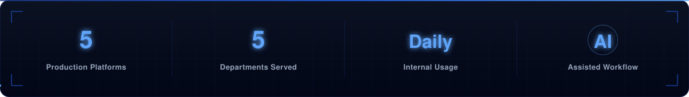
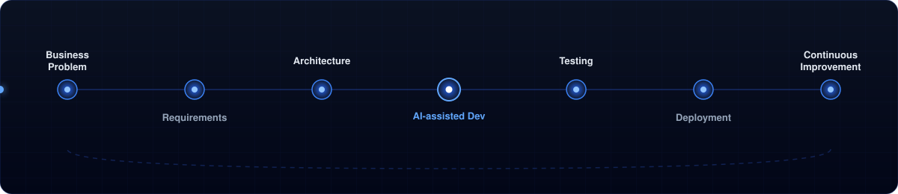
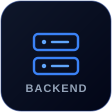
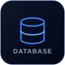
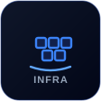
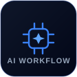

<!-- ╔══════════════════════════════════════════════════════════════╗ -->
<!-- ║  Daniel Teodoro · Perfil README · design dark / azul           ║ -->
<!-- ╚══════════════════════════════════════════════════════════════╝ -->

  

  <a href="./README.md">English</a>
  &nbsp;·&nbsp;
  <a href="./README_pt.md"><b>Português</b></a>

  <code>Engenheiro de Software</code> &nbsp;•&nbsp;
  <code>Sistemas de Negócio</code> &nbsp;•&nbsp;
  <code>Tecnologia Financeira</code> &nbsp;•&nbsp;
  <code>Automação</code>

## &nbsp; O engenheiro por trás dos sistemas

Construo software interno usado diariamente pelas equipes de financeiro, logística, comercial e gestão: plataformas financeiras, dashboards operacionais e ferramentas de automação que sustentam decisões reais. Escrever o código vem depois. Entender o problema de negócio o suficiente pra saber o que vale a pena construir vem primeiro, moldado por uma formação dividida entre Engenharia de Software e Administração.

 

  

## &nbsp; O que eu faço

<table>
<tr>
<td width="50%" valign="top">

**Gestão Financeira**
DRE projetado, fluxo de caixa, contas a receber e os indicadores que a liderança acompanha.

**Business Intelligence**
Dashboards e KPIs que substituem planilhas frágeis por dados vivos e consultáveis.

**Automação**
Extração de documentos, pipelines de ETL e rotinas que eliminam trabalho manual e repetitivo.

</td>
<td width="50%" valign="top">

**Plataformas Internas**
Sistemas operacionais usados diariamente entre setores, com autenticação e controle de acesso por cargo.

**Integração de Dados**
Ponte entre dados de ERP legado (DBF / TOTVS) e aplicações modernas com PostgreSQL.

**Análise de Negócio**
Entender um processo manual ou quebrado, conversar com quem convive com ele no dia a dia, e decidir o que vale a pena construir antes de escrever qualquer código.

</td>
</tr>
</table>

## &nbsp; Missão atual

> **Construo os sistemas que a empresa usa para tomar decisões, e participo das decisões que eles geram.**
>
> Substituir planilhas por aplicações web.
> Transformar exportações brutas do ERP em decisões confiáveis.
> Entregar à gestão números reais, em tempo real, em vez de relatórios de uma semana atrás.

 

## &nbsp; Como eu trabalho

  

  
    Problema de Negócio → Requisitos → Arquitetura → Desenvolvimento com IA → Testes → Deploy → Melhoria Contínua
  

## &nbsp; Plataformas em destaque

Construídas para uso em produção. Os repositórios são mantidos **privados** porque o código contém informações confidenciais da empresa.

 

<table>
<tr>
<td colspan="2" valign="top">

### ▣ &nbsp;Plataforma de Gestão Integrada &nbsp;· principal

O que começou como um DRE financeiro virou o hub de operações interno da empresa. Uma plataforma, vários setores, todos rodando sobre os mesmos dados ao vivo.

| Módulo | O que faz |
|--------|-----------|
| **Financeiro** | DRE projetado e realizado com back-testing, calendário de fluxo de caixa, contas a receber, indicadores |
| **RH** | Folha de ponto digital, controle de banco de horas, resumo da folha |
| **Compras** | Pedidos, orçamento de compras e o impacto deles no financeiro |
| **Logística** | Endereçamento de estoque e centro de distribuição, movimentação de pallets e controle de inventário, reconstruído dentro da plataforma depois de começar como sistema separado |
| **Comercial** | Indicadores de vendas, desempenho de vendedores e análise de clientes |
| **Dados** | ETL automatizado importando dados do ERP legado (DBF / TOTVS) para o PostgreSQL a cada poucos minutos |

`Node.js` · `Express` · `PostgreSQL` · `Python ETL` · `Docker` · `Nginx`

Privado · produção · usado entre setores todos os dias

</td>
</tr>
<tr>
<td width="50%" valign="top">

### ◆ &nbsp;Plataforma de Captação em Campo

Transforma a equipe de vendas em uma rede de prospecção em campo.

- Consultores registram obras e prospects no local
- Mais de 200 obras captadas até hoje
- Fotos (comprimidas automaticamente) e geolocalização GPS por lead
- Mapa interativo de cada oportunidade captada
- Distribuição de leads e acompanhamento de follow-up
- Single sign-on com a plataforma principal (HMAC)

`Python` · `Flask` · `SQLite` · `Pandas`

Privado · produção · uso diário

</td>
<td width="50%" valign="top">

### ◇ &nbsp;Plataforma de Processamento de Notas

Tira a digitação manual da rotina financeira.

- Extração de PDF · leitura de XML (NF-e)
- Conciliação automatizada direto no banco

`Python` · `Automação` · `PostgreSQL`

Privado · produção

</td>
</tr>
<tr>
<td colspan="2" valign="top">

### ◷ &nbsp;Plataforma de Solicitação de Estoque

Coordena o fluxo entre vendas e o centro de distribuição.

- Confirmação de estoque e fluxo estruturado de solicitação
- Acompanhamento de status e comunicação interna

`Node.js` · `PostgreSQL` · `EJS`

Privado · produção

</td>
</tr>
</table>

## &nbsp; Projeto pessoal

Não é trabalho da empresa. Construído no meu tempo livre pra aprender o que a stack interna não cobre: front-end moderno, tempo real, OAuth.

 

<table>
<tr>
<td colspan="2" valign="top">

### ▲ &nbsp;Spotter &nbsp;· app pra encontrar parceiro de treino

Conecta pessoas que treinam sozinhas com parceiros de treino na mesma academia e horário.

- Onboarding em várias etapas: academia, horário, objetivos, interesses
- Feed com posts de fotos, comentários e combinação de perfis
- Chat em tempo real (individual e em grupo) via Socket.IO
- Eventos com mapa, álbum de fotos compartilhado e chat do evento
- Google OAuth, sessões JWT, API com rate limiting

`React Native` · `Expo` · `Express` · `PostgreSQL` · `Socket.IO`

Pessoal · em desenvolvimento

</td>
</tr>
</table>

## &nbsp; Stack

<table>
<tr>
<td align="center" width="16.6%"></td>
<td align="center" width="16.6%"></td>
<td align="center" width="16.6%"></td>
<td align="center" width="16.6%"></td>
<td align="center" width="16.6%"></td>
<td align="center" width="16.6%"></td>
</tr>
<tr>
<td align="center">Python · Flask Node.js · Express</td>
<td align="center">JavaScript · React Native HTML · CSS</td>
<td align="center">PostgreSQL SQLite · SQL</td>
<td align="center">Power BI Power Apps</td>
<td align="center">Docker · Nginx Git</td>
<td align="center">Engenharia assistida por IA</td>
</tr>
</table>

## &nbsp; IA no meu fluxo de engenharia

<table>
<tr>
<td width="62%" valign="top">

A IA faz parte de como eu construo. Não é enfeite e não substitui engenharia.

Eu uso para avançar mais rápido na implementação: scaffolding, código repetitivo, refatorações, descoberta de casos de borda e documentação. Ela encurta a distância entre uma decisão e o código funcionando.

**As decisões continuam minhas.** Arquitetura, modelagem de dados, fronteiras de segurança, trade-offs e o que significa *correto* para o negócio: isso vem de entender o problema, não de um prompt. A IA acelera a digitação. O pensamento continua sendo meu.

</td>
<td width="38%" valign="top">

</td>
</tr>
</table>

## &nbsp; Atividade no GitHub

<table>
<tr>
<td align="center" valign="top">
  
</td>
<td align="center" valign="top">
  
</td>
</tr>
</table>

 

  

## &nbsp; Contato

  
  &nbsp;
  
  &nbsp;
  

  Brasil · construindo software de produção que resolve problemas reais de negócio.

